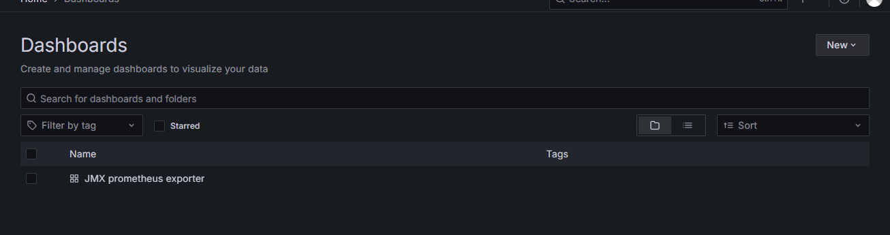
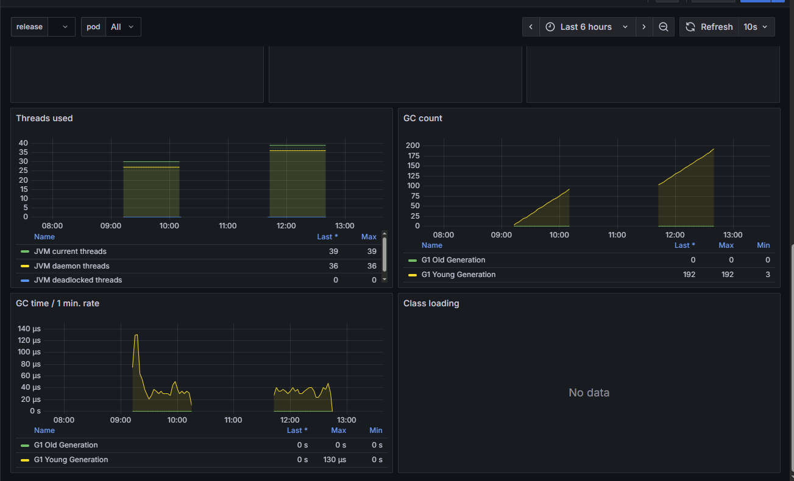

# **Prometheus and graphana**

## ***Prometheus JMX exporter***     

### JAVA    
- a java agent with a config file launched from the docker container with CATALINA_OPTS : it will be started in the jvm at the same time than tomcat.
    - javaagent:<path_to_prometheusJar>/jmx_prometheus_javaagent-1.4.0.jar=<port_number>:<path_to_config>/config.yaml"
    - the port number must be exposed by the container : will be used to scrap the data

### Other prometheus exporters        
[Exporters and integrations](https://prometheus.io/docs/instrumenting/exporters/)     
for instance :      
- [Nginx metric library](https://github.com/knyar/nginx-lua-prometheus)  
- [AWS ECS exporter](https://github.com/slok/ecs-exporter)  
- [AWS Health exporter](https://github.com/Jimdo/aws-health-exporter)   
- [AWS RDS exporter](https://github.com/qonto/prometheus-rds-exporter)  

## ***Prometheus server***     

run on http://localhost:9090/,      
usually not used in day to day operations : use graphana, dashboard and UI      
- setup to scrap the JMX exporter data      

- job_name: "prometheus"
  static_configs:
    - targets: ["127.0.0.1:9090"]
- 
- job_name: "jmx-exporter"
  static_configs:
    - targets: ["host.docker.internal:9115"]

9115 : the port number previously used by the jmx_prometheus_javaagent 
host.docker.internal : better use this than localhost : the exporter is not on the same host than the prometheus server

check the scraps :
    http://localhost:9090/targets

## ***Graphana server***    

http://127.0.0.1:3000/login         
admin:admin first time to connect, 
 
add data source prometheus  
    http://127.0.0.1:3000/connections/datasources/edit/bf20ocks0cjy8e

/!\ for testing :       
    Prometheus server URL *         
    http://host.docker.internal:9090

/!\ for the docker-compose, the "host.docker.internal" is really important : localhost won't do 

    Save and go explore the view or build dashboards 

### import dashboard as a json
https://grafana.com/grafana/dashboards/7727-jvm-overview/
https://grafana.com/api/dashboards/7727/revisions/1/download

### deploy on AWS ECS 
https://medium.com/@ahmadbilalch891/deploying-grafana-loki-and-prometheus-on-aws-ecs-with-efs-and-cloud-formation-part-3-of-3-24140ea8ccfb

jfrog airbus : bitnami/prometheus12-09-25 17:21:16 +0200
https://artifactory.2b82.aws.cloud.airbus.corp/ui/packages/docker:%2F%2Fbitnami%2Fprometheus?name=prometheus&type=packages
docker pull r-bitnami-archive-docker-local.artifactory.2b82.aws.cloud.airbus.corp/bitnami/prometheus:sha256__6598ed4a6a4a69590dd6bc0f43abb9b1317a2fb78f4fadedaacb2168f2dd1160

