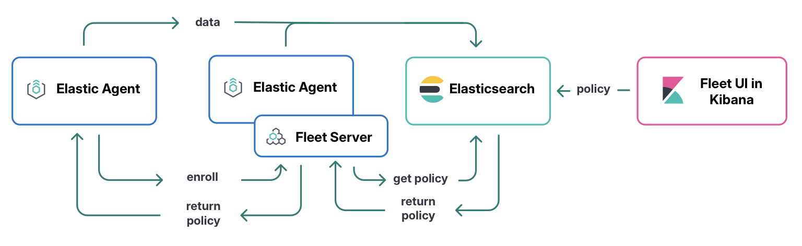

# Stack ELK

## Kibana 
UI used to load elastic agents and setup fleet server 

## Fleet server
install a fleetserver 
-> elastic agent used as a fleet server     

## Elastic-agent
    - scrap JMX prometheus exporter

https://www.elastic.co/docs/reference/fleet/fleet-server#:~:text=Does%20Fleet%20Server%20run%20inside,a%20special%20Fleet%20Server%20policy.

Admonition
Does Fleet Server run inside of Elastic Agent?
Fleet Server is a subprocess that runs inside a deployed Elastic Agent.
This means the deployment steps are similar to any Elastic Agent, except that you enroll the agent in a special Fleet Server policy.
Typically—especially in large-scale deployments—this agent is dedicated to running Fleet Server as an Elastic Agent communication host and is not configured for data collection.

## NOTES

list of 
https://localhost:9200/_cat/indices