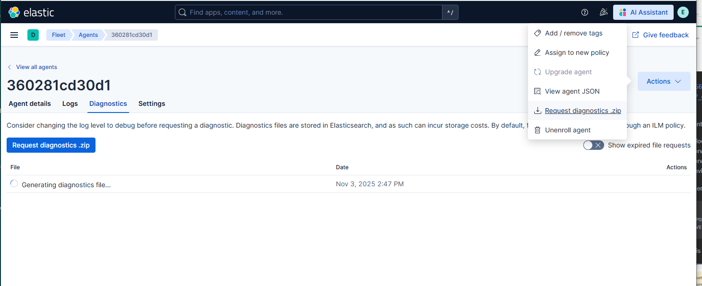

## Setup a new policy
-> new name
-> generate token

-> use the  FLEET_SERVER_POLICY_NAME and not the FLEET_SERVER_POLICY_ID (some bug apparently)

      - FLEET_URL=https://fleet-server:8220
      - FLEET_SERVER_ENABLE=true
      - FLEET_INSECURE=true
      - FLEET_SERVER_ELASTICSEARCH_HOST=https://es01-server:9200
      - FLEET_SERVER_ELASTICSEARCH_CA=/certs/ca/ca.crt
      - FLEET_SERVER_ELASTICSEARCH_INSECURE=true
      - FLEET_SERVER_INSECURE_HTTP=true
      - FLEET_SERVER_SERVICE_TOKEN=AAEAAWVsYXN0aWMvZmxlZXQtc2VydmVyL3Rva2VuLTE3NjIxNzU2Njg3Njk6YVR0Y0FUWDRSTlNMa3Z3QU9Sdnc5UQ
      - FLEET_SERVER_POLICY_NAME=fleet-server-policy

--> still some warning logs about not beeing able to connect to the localhost:9200 (elasticsearch)
{"log.level":"warn","@timestamp":"2025-11-03T13:20:03.352Z","message":"Failed Elasticsearch output configuration test, using bootstrap values.","component":{"binary":"fleet-server","dataset":"elastic_agent.fleet_server","id":"fleet-server-default","type":"fleet-server"},"log":{"source":"fleet-server-default"},"ecs.version":"1.6.0","service.name":"fleet-server","service.type":"fleet-server","error.message":"dial tcp [::1]:9200: connect: connection refused","output":{"Elasticsearch":{"Headers":null,"Hosts":["localhost:9200"],"MaxConnPerHost":128,"MaxContentLength":104857600,"MaxRetries":3,"Path":"","Protocol":"https","ProxyDisable":false,"ProxyHeaders":{},"ProxyURL":"","ServiceToken":"[redacted]","ServiceTokenPath":"","TLS":{"CASha256":null,"CATrustedFingerprint":"","CAs":["/certs/ca/ca.crt"],"Certificate":{"Certificate":"","Key":"","Passphrase":"","PassphrasePath":""},"CipherSuites":null,"CurveTypes":null,"Enabled":null,"Renegotiation":"never","VerificationMode":"none","Versions":null},"Timeout":90000000000},"Extra":null},"ecs.version":"1.6.0"}

http://localhost:5601/app/dashboards#/view/elastic_agent-1a4e7280-6b5e-11ed-98de-67bdecd21824?_g=(filters:!(),refreshInterval:(pause:!t,value:60000),time:(from:now-15m,to:now))

enroll elatic agent from tomcat ...

-javaagent:/usr/local/tomcat/bin/monitoring/elastic-apm-agent-1.54.0.jar 
-Delastic.apm.service_name=TestLocal 
-Delastic.apm.application_packages=* 
-Delastic.apm.server_url=http://host.docker.internal:8200 
-Delastic.apm.environment=TEST \

--enrollment-token

    ports:
      - ${FLEET_PORT}:8220
      - ${APMSERVER_PORT}:8200

but fleet server is unhealthy : cannot enroll in this state 

diagnositc bundle 

well, actualy it was fine, just give it some time I guess...  

Enrollments 
https://www.elastic.co/docs/reference/apm/agents/java/setup-javaagent

--exec
-javaagent:/path/to/elastic-apm-agent-<version>.jar
-Delastic.apm.service_name=my-cool-service
-Delastic.apm.application_packages=org.example,org.another.example
-Delastic.apm.server_url=http://127.0.0.1:8200

trying to connect to APM Server at http://host.docker.internal:8200/intake/v2/events.

2025-11-03 15:54:37 03-Nov-2025 14:54:37.292 INFO [main] org.apache.catalina.startup.Catalina.start Server startup in [242] milliseconds
2025-11-03 15:56:14 2025-11-03 14:56:14,142 [elastic-apm-server-reporter] ERROR co.elastic.apm.agent.report.AbstractIntakeApiHandler - Error trying to connect to APM Server at http://host.docker.internal:8200/intake/v2/events. Although not necessarily related to SSL, some related SSL configurations corresponding the current connection are logged at INFO level.
2025-11-03 15:56:14 2025-11-03 14:56:14,143 [elastic-apm-server-reporter] ERROR co.elastic.apm.agent.report.IntakeV2ReportingEventHandler - Failed to handle event of type METRICSET_JSON_WRITER with this error: Connection refused

2025-11-03 15:58:26 2025-11-03 14:58:26,162 [elastic-apm-server-reporter] ERROR co.elastic.apm.agent.report.AbstractIntakeApiHandler - Error sending data to APM server: Unexpected end of file from server, response code is -1

2025-11-03 16:14:02 {"log.level":"info","@timestamp":"2025-11-03T15:14:02.436Z","message":"Running on default policy with Fleet Server integration","component":{"binary":"fleet-server","dataset":"elastic_agent.fleet_server","id":"fleet-server-fleetserver-output-df807d71-94ec-4a1a-a776-97c312dcd3be","type":"fleet-server"},"log":{"source":"fleet-server-fleetserver-output-df807d71-94ec-4a1a-a776-97c312dcd3be"},"ecs.version":"1.6.0","service.name":"fleet-server","service.type":"fleet-server","state":"HEALTHY","ecs.version":"1.6.0"}

